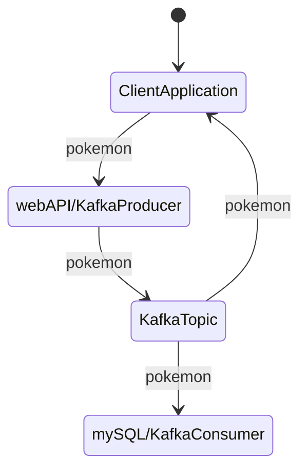

## Kristian Karlson

## Inlämningsuppgift YH Campus Mölndal Jinv23

## Systemintegration 45 YHP

### Beskrivning av projektet
### Vad du har gjort

Skapat ett projekt med 4 moduler. En konsol Client, WebApi/Kafka Producer, Kafka consumer som sparar i mySQL databas. En
Modul med Objektet Som ska hanteras av alla moduler.

Projektet består av tre moduler en klientapplikation som slumpar fram fiktiva Pokémon som skickas till ett webAPI.  
webApi skickar sen vidare payload på ett Kafka topic. Topic läses av en Kafka consumer som sparar objekten i en mySQL
databas.  
Klientapplikationen läser av samma topic så man kan visuellt bekräfta att informationen har skickats på topic.

### Flödesschema



En pokemon är ett objekt. Den separata modulen skapar alla objekt. I Json ser en pokemon ut såhär:  
```json
{  
    "pokedexNumber": 6,  
    "name": "Charizard",  
    "total": 534,  
    "hp": 78,  
    "attack": 84,  
    "defence": 78,  
    "types":[  
        {  
        "slot": "first",  
        "type": "FIRE"  
        },  
        {  
        "slot": "second",  
        "type": "FLYING"  
        }  
    ]  
}  
``` 
### Starta applikationen

1. Ladda ner Apache Kafka från https://kafka.apache.org/ applikationen är testad med version 3.5.1  
2. Extrahera nedladdningen till valfri mapp på din dator.
3. Kopiera filerna server1.properties, server2.properties & server3.properties från DWSJ/kafkaConfigs till din installation av Kafka/config
4. I varje server.properties fil på rad 62 konfigurera mappen som kafkas message broker ska logga filerna, varje broker kräver en separat mapp. Exempel: log.dirs=C:\temp\kakfa\logs\broker92\kafka-logs
5. Öppna filen kafka/config/zookeeper.properties och ställ in lämplig mapp exempelvis: dataDir=C:\temp\kakfa\logs\zookeeper
6. Öppna fyra stycken terminaler i din kafka mapp. Kör ett kommando i vardera terminal  
   1. .\bin\windows\zookeeper-server-start.sh config\zookeeper.properties
   2. .\bin\windows\kafka-server-start.sh config\server1.properties
   3. .\bin\windows\kafka-server-start.sh config\server2.properties
   4. .\bin\windows\kafka-server-start.sh config\server3.properties
7. Installera mySQL server https://www.mysql.com/
8. Skapa schema "pokedb" och koppla till användare "user" med lösenord "password" med rättigheter till schemat
   1. Alternativt ändra i filen /DWSJ/Pokemon-Consume-SQL/src/main/resources/application.properties
9. Frivilligt, skapa schema "testdb" med användare "test" lösenord "test" och rättigheter till schemat
   1.  Alternativt ändra i filen /DWSJ/Pokemon-Consume-SQL/src/test/resources/application-test.properties
10. Starta modulen Pokemon-producer den kräver tillgång till port 8080
11. Starta modulen Pokemon-consume-SQL
12. Starta modulen User-Client


How to use:
Start Kafka Zookeper with default config
Start one or more kafka brokers on localhost ports 9092-9094, customized configs is located in kafkaConfigs
You will need to set the logging directory's in the kafka server.properties files
Start a mysql server on port localhost:3306 make a Schema "pokedb"
create "user" with "password" and give them privileges to the schema
for testing create schema "testdb" and a user "test" password "test" with privileges to schema

Run module "Pokemon producer" to get the web api running att localhost:8080
Run module "Pokemon-consume-SQL" to store all the Pokémons in the database
The "User-client" is a client application with a console menu. It will find random pokémons and the user can give the pokemon a name and send it to the webAPI

### Konfiguration av Kafka kluster

Skriv dokumentation som beskriver ditt Apache Kafka-klusters
konfiguration och hur producenten och konsumenterna är
implementerade.
vg:  
Optimering: Utvärdera och implementera effektiva sätt att
skicka och behandla meddelanden i ditt Kafka-kluster.
● Konfigurera Apache Kafka för att hantera replikering och
felhantering för att säkerställa hög tillgänglighet.
● Utöka dokumentationen med en djupare förståelse av de val
du gjort avseende konfiguration, säkerhet och optimering.


## Arbetet och dess genomförande

### Vad som varit svårt

Inledningsvis fanns det problem med att hanterandet av objekten då de definierades i alla moduler. När det bröts ut till
egen modul blev ändringar lättare att genomföra.  
Dependecys i moduler att rätt ska är på rätt plats.

### Beskriv lite olika lösningar du gjort

Bröts ut objekten till egen modul, då följde förändringar med genom alla moduler. Använde mig av "create-drop" av
databasen för att snabbt kunna testa olika lösningar.
Kört MySQL och Kafka i Docker containers, väldigt smidigt!

### Beskriv något som var besvärligt att få till

Spara pokemon objekten i databasen, kopplingen med underobjekten och huvudobjektet.
Dezerializera json kafka meddelanden som objekt

### Beskriv om du fått byta lösning och varför i sådana fall

Inledningsvis deserializerade jag json objekten med Jacksons object-mapper, för att kunna skapa "bättre" utformade
objekt för att spara i databasen. Det skapade ömtålig datastruktur.

## Slutsatser

Springboot är väldigt kraftfullt och besparar mycket skrivande av kod. Integration med Kafka är lätt att genomföra och
meddelanden skickas väldigt fort genom systemet.

### Vad gick bra

Applikationerna fungerar bra, lätt att bygga vidare på förändringar i objekten som skickas behöver bara ske på ett
ställe. Linux är mycket stabil och bra utvecklingsmiljö för Java Springboot och Kafka projekt.

### Vad gick dåligt

Skrev massa kul kod för att hantera objekt och tables i databaser, helt i onödan.  
Det är stökigt med dependecys i de olka modulerna

### Vad har du lärt dig

Springboot, modulära projekt, skapa webAPI, SQL hantering med JPA, Apache Kafka, Docker

### Vad hade du gjort annorlunda om ni gjort om projektet

Redan från början skapat projektet med moduler.

### Vilka möjligheter ser du med de kunskaper du fått under kursen.

Implementera och använda kafkalösningar för kommunikation mellan appar. Smidigt lagrade av data med JPA. 
