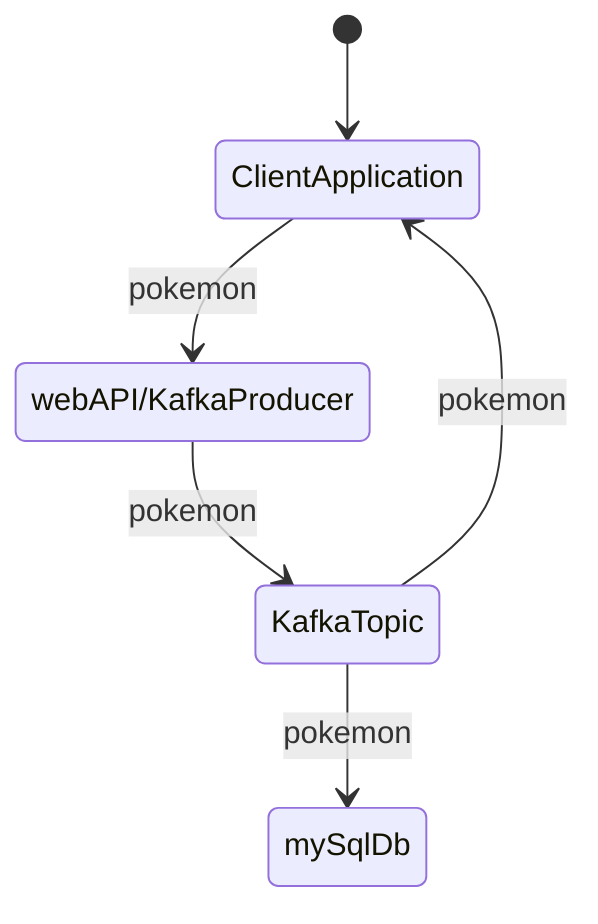

## Kristian Karlson
## Inlämningsuppgift YH Campus Mölndal Jinv23 
## Systemintegration 45 YHP

### Beskrivning av projektet
Projektet består av tre en klientapplikation som slumpar fram fiktiva Pokémon som skickas till ett webAPI.  
webApi skickar sen vidare payload på ett Kafka topic. Topic läses av en Kafka consumer som sparar objekten i en mySQL databas.  
Klientapplikationen läser av samma topic så man kan visuellt bekräfta att informationen har skickats på topic. 

### Grovplanering

### Vad du har gjort
Skapat ett projekt med 4 moduler. En konsol Client, WebApi/Kafka Producer, Kafka consumer som sparar i mySQL databas. En Modul med Objektet Som ska hanteras av alla moduler.

## Arbetet och dess genomförande

### Vad som varit svårt
Inledningsvis fanns det problem med att hanterandet av objekten då de definierades i alla moduler. När det bröts ut till egen modul blev ändringar lättare att genomföra.  
Dependecys i moduler att rätt ska är på rätt plats.

### Beskriv lite olika lösningar du gjort
Bröts ut objekten till egen modul, då följde förändringar med genom alla moduler. Använde mig av "create-drop" av databasen för att snabbt kunna testa olika lösningar.
Kört MySQL och Kafka i Docker containers, väldigt smidigt!

### Beskriv något som var besvärligt att få till
Spara pokemon objekten i databasen, kopplingen med underobjekten och huvudobjektet.
Dezerializera json kafka meddelanden som objekt

### Beskriv om du fått byta lösning och varför i sådana fall
Inledningsvis deserializerade jag json objekten med Jacksons object-mapper, för att kunna skapa "bättre" utformade objekt för att spara i databasen. Det skapade ömtålig datastruktur.

## Slutsatser
Springboot är väldigt kraftfullt och besparar mycket skrivande av kod. Integration med Kafka är lätt att genomföra och meddelanden skickas väldigt fort genom systemet.

### Vad gick bra
Applikationerna fungerar bra, lätt att bygga vidare på förändringar i objekten som skickas behöver bara ske på ett ställe.  
Linux är mycket stabil och bra utvecklingsmiljö för kafka projekt.

### Vad gick dåligt
Skrev massa kul kod för att hantera objekt och tables i databaser, helt i onödan.  
Det är stökigt med dependecys i de olka modulerna

### Vad har du lärt dig
Springboot, modulära projekt, skapa webAPI, SQL hantering med JPA, Apache Kafka, Docker

### Vad hade ni gjort annorlunda om ni gjort om projektet
Redan från början skapat projektet med moduler.

### Vilka möjligheter ser du med de kunskaper du fått under kursen.
Implementera och använda kafkalösningar för kommunikation mellan appar. Smidigt lagrade av data med JPA. 
