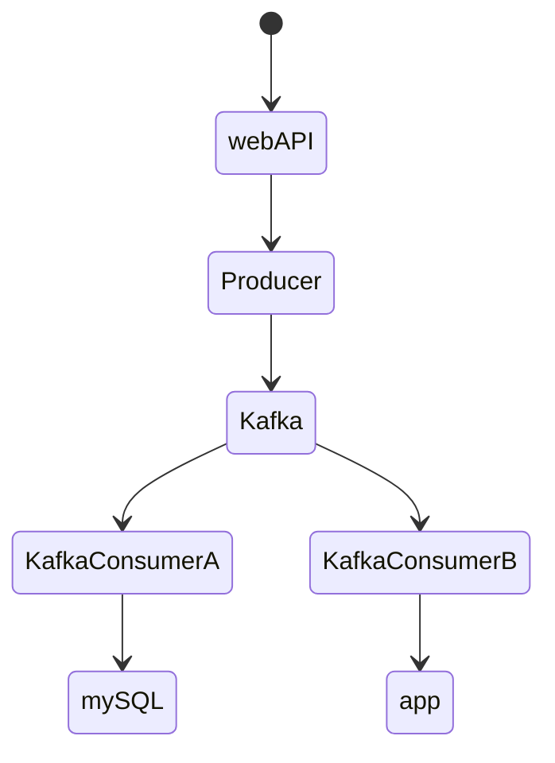

First plan of structure
Only one topic in kafka

### att göra 
[ ] Skapa tester tidigt

Ska hantera Pokemons med egenskaperna  
{  
"Id":"integer",  
"Name":"String",  
"Type":{  
"typeA":"String",  
"typeB":"String"  
},  
"Total":"integer",  
"HP":"integer",
"Attack":"integer",  
"Defense":"integer"  
}

En Pokemon är vanligtvis av två typer men det förekommer Pokemons som bara tillhör en typ.

Kan vara fördelaktigt att formatera data på nedanstående sätt.  
{  
"Id":"integer",  
"Name":"String",  
"Type":["String", "String"],  
"Total":"integer",  
"HP":"integer",  
"Attack":"integer",  
"Defense":"integer"  
} 